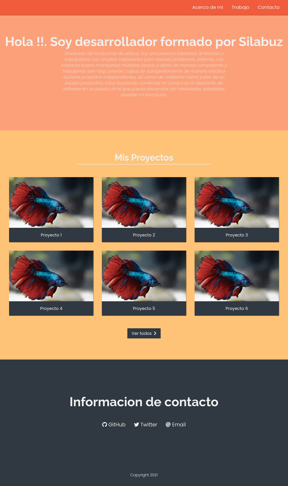

<!-- Indicaciones Generales -->
<h1> Indicaciones Generales</h1> 
<li>El ejercicio debe estar alojado en su propia carpeta</li>
<li>Los archivos estáticos (imágenes, etc.) deben estar alojados dentro de una carpeta nombrada static.</li>
<li>Cada ejercicio debe extraer los estilos de una hoja externa nombrada styles.css </li>

 

<!-- Ejercicio -->
<h1> Ejercicio </h1> 
<h2>Planteamiento del problema</h2>

Se requiere crear una página web estilo portafolio personal estructurada de forma  que:

<li>Se tenga una barra de navegación que se mantenga en el top incluso cuando se haga scroll</li> 
<li>Sección de presentación como desarrollador</li>
<li>Sección donde listen sus proyectos</li>
<li>Footer al pie de la página</li>

 
<h2>Resultado esperado: </h2>
</img>
 
 
